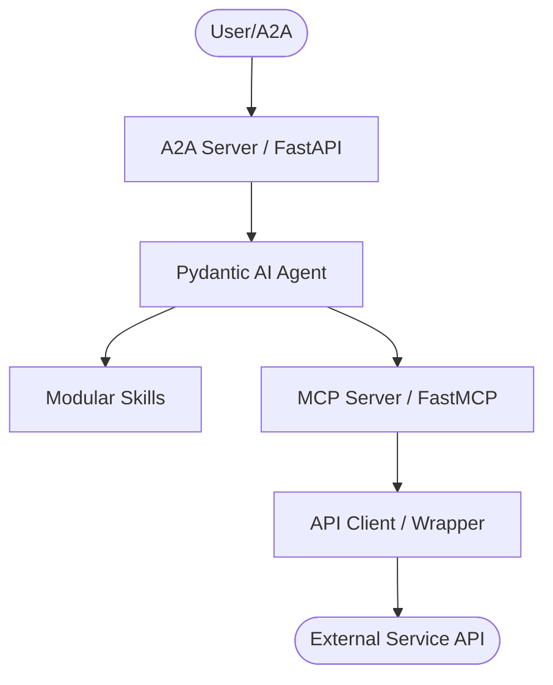
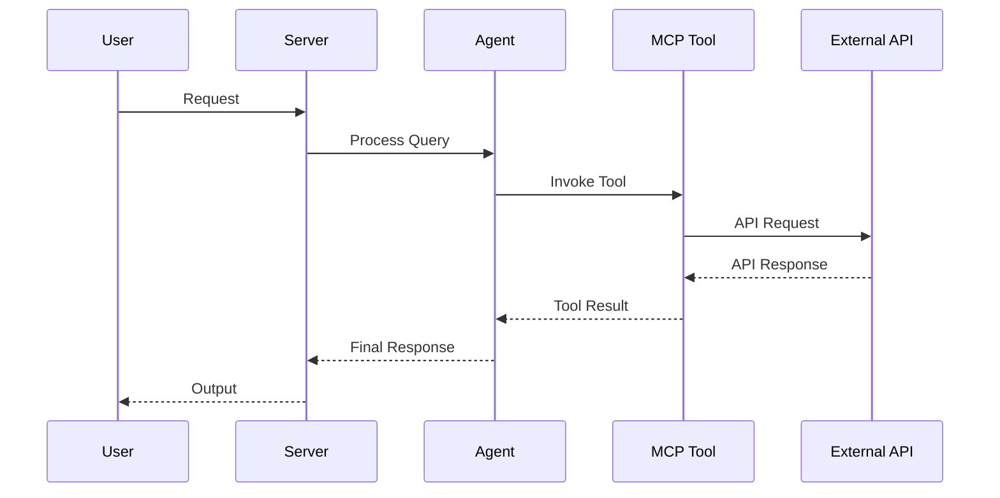

# AGENTS.md

> Claude Code loads this file via `CLAUDE.md` (`@AGENTS.md` import) — the two stay
> in sync. Edit **this** file, not `CLAUDE.md`.

## Tech Stack & Architecture
- Language/Version: Python 3.10+
- Core Libraries: `agent-utilities`, `fastmcp`, `pydantic-ai`, `atlassian-python-api`
- Key principles: Functional patterns, Pydantic for data validation, asynchronous tool execution.
- Architecture:
    - `mcp_server.py`: Main MCP server entry point and tool registration.
    - `agent_server.py`: Pydantic AI agent definition and logic.
    - `skills/`: Directory containing modular agent skills (if applicable).
    - `agent/`: Internal agent logic and prompt templates.
    - `api/`: Atlassian API clients for Jira and Confluence (Cloud and Server)
    - `tools/`: Tool implementations for various Atlassian products

### Architecture Diagram


### Workflow Diagram


## Commands

### Installation
```bash
# Basic installation
pip install .

# Installation with all optional dependencies
pip install .[all]

# Development installation
pip install -e .[all]
```

### Quality & Linting (run from project root)
```bash
# Run all pre-commit hooks
pre-commit run --all-files

# Run specific hook
pre-commit run black --all-files
pre-commit run ruff --all-files
pre-commit run codespell --all-files

# Run linters directly
black .
ruff check .
ruff check . --fix
```

### Testing
```bash
# Verify tools registration
python verify_tools.py

# Run the MCP server in stdio mode for testing
atlassian-mcp --transport "stdio"

# Run the agent server
atlassian-agent --provider openai --model-id gpt-4o --api-key $OPENAI_API_KEY

# Manual testing of specific tools
# Example: Test Jira cloud tools
python -c "from atlassian_agent.tools.jira_cloud_tools import *; print('Tools loaded successfully')"

# Example: Test Confluence cloud tools
python -c "from atlassian_agent.tools.confluence_cloud_tools import *; print('Tools loaded successfully')"

# Docker-based testing
# Build and run for quick verification
docker build -t atlassian-agent .
docker run --rm -e ATLASSIAN_AGENT_URL="http://dummy" -e ATLASSIAN_AGENT_TOKEN="dummy" atlassian-agent atlassian-mcp --transport "stdio"
```

### Running a Single Test/Verification
```bash
# Verify a specific tool module imports correctly
python -c "import atlassian_agent.tools.jira_cloud_tools; print('Jira Cloud tools module loaded')"

# Verify a specific API client loads
python -c "import atlassian_agent.api.jira_cloud_api; print('Jira Cloud API module loaded')"

# Check environment variable loading
python -c "import os; from dotenv import load_dotenv; load_dotenv(); print('URL:', os.getenv('ATLASSIAN_AGENT_URL', 'Not set'))"

# Run the verification script
python verify_tools.py
```

## Execution Commands
# Run MCP Server
atlassian-mcp
# Run Agent
atlassian-agent

## Project Structure Quick Reference
- MCP Entry Point → `mcp_server.py`
- Agent Entry Point → `agent_server.py`
- Source Code → atlassian_agent/
- API Clients → atlassian_agent/api/
- Tool Implementations → atlassian_agent/tools/
- Internal Agent Logic → atlassian_agent/agent/
- Skills → `skills/` (if exists)

### File Tree
```text
├── .bumpversion.cfg
├── .dockerignore
├── .env
├── .gitattributes
├── .gitignore
├── .pre-commit-config.yaml
├── AGENTS.md
├── Dockerfile
├── LICENSE
├── MANIFEST.in
├── README.md
├── compose.yml
├── debug.Dockerfile
├── atlassian_agent
│   ├── __init__.py
│   ├── agent_server.py
│   ├── auth.py
│   ├── mcp_server.py
│   ├── models.py
│   ├── api
│   │   ├── __init__.py
│   │   ├── base.py
│   │   ├── user_provisioning_cloud_api.py
│   │   ├── dlp_cloud_api.py
│   │   ├── control_cloud_api.py
│   │   ├── user_mgmt_cloud_api.py
│   │   ├── org_cloud_api.py
│   │   ├── api_access_cloud_api.py
│   │   ├── admin_cloud_api.py
│   │   ├── confluence_server_api.py
│   │   ├── confluence_cloud_api.py
│   │   ├── jira_server_api.py
│   │   └── jira_cloud_api.py
│   ├── tools
│   │   ├── __init__.py
│   │   ├── user_provisioning_cloud_tools.py
│   │   ├── dlp_cloud_tools.py
│   │   ├── control_cloud_tools.py
│   │   ├── user_mgmt_cloud_tools.py
│   │   ├── org_cloud_tools.py
│   │   ├── api_access_cloud_tools.py
│   │   ├── admin_cloud_tools.py
│   │   ├── confluence_server_tools.py
│   │   ├── confluence_cloud_tools.py
│   │   ├── jira_server_tools.py
│   │   └── jira_cloud_tools.py
│   └── agent
│       ├── __init__.py
│       ├── IDENTITY.md
│       ├── A2A_AGENTS.md
│       ├── AGENTS.md
│       ├── USER.md
│       ├── CRON_LOG.md
│       ├── HEARTBEAT.md
│       ├── CRON.md
│       └── MEMORY.md
├── pyproject.toml
├── requirements.txt
├── scripts
│   └── generate_atlassian_suite.py
└── verify_tools.py
```

## Code Style & Conventions

**Always:**
- Use `agent-utilities` for common patterns (e.g., `create_mcp_server`, `create_agent`).
- Define input/output models using Pydantic.
- Include descriptive docstrings for all tools (they are used as tool descriptions for LLMs).
- Check for optional dependencies using `try/except ImportError`.
- Follow PEP 8 style guidelines.
- Use type hints for all function parameters and return values.
- Keep lines to a maximum of 88 characters (Black default).
- Use absolute imports within the package (e.g., `from atlassian_agent.tools.jira_cloud_tools import ...`).
- Group imports: standard library, third-party, local application/library.

**Imports:**
```python
# Standard library
import os
import sys
from typing import Optional, List, Dict, Any

# Third-party
from pydantic import BaseModel, Field
from agent_utilities import create_mcp_server

# Local application/library
from atlassian_agent.tools.base_tool import BaseTool
from atlassian_agent.api.jira_cloud_api import JiraCloudApiClient
```

**Formatting:**
- Use Black for code formatting (already configured in pre-commit).
- Use Ruff for linting (already configured in pre-commit).
- String formatting: Use f-strings for Python 3.6+.
- Quotes: Use double quotes for strings unless containing quotes.
- Trailing commas: Use in multi-line imports, function calls, and definitions for cleaner diffs.

**Types:**
- Use Pydantic models for all input/output validation.
- Use Python's typing module for complex types (List, Dict, Optional, Union, etc.).
- Always specify return types for functions.
- Use `Optional[T]` for values that can be None.
- Use `List[T]` for homogeneous lists.
- Use `Dict[str, T]` for dictionaries with string keys.

**Naming Conventions:**
- Classes: PascalCase (e.g., `JiraCloudApiClient`)
- Functions and variables: snake_case (e.g., `get_jira_issue`)
- Constants: UPPER_SNAKE_CASE (e.g., `MAX_RESULTS`)
- Private functions/variables: _snake_case (e.g., `_validate_input`)
- Tool names: snake_case with descriptive names (e.g., `jira_create_issue`)
- Resource names: snake_case (e.g., `jira_issue`)

**Error Handling:**
- Catch specific exceptions rather than bare `except:`
- Log errors appropriately using the logging module
- Raise meaningful exceptions with context
- For MCP tools, return error messages that LLMs can understand
- Use try/except blocks for external API calls
- Validate inputs early and raise ValidationError for invalid data

**Docstrings:**
- All public functions and classes must have docstrings
- Tool functions must have descriptive docstrings that LLMs can understand
- Follow Google or NumPy docstring style
- Include parameter types, return types, and exceptions raised
- Example:
```python
"""Create a new Jira issue.

Args:
    summary: The issue summary
    description: The issue description
    issue_type: The type of issue (Task, Bug, Story, etc.)
    project_key: The project key (e.g., 'PROJ')

Returns:
    Dictionary containing the created issue details

Raises:
    AtlassianApiError: If the API request fails
    ValidationError: If input parameters are invalid
"""
```

**Security:**
- Never hardcode secrets; use environment variables or `.env` files
- Validate all inputs to prevent injection attacks
- Use proper authentication mechanisms
- Log access to sensitive data when appropriate

**Testing Practices:**
- Write unit tests for all new functionality
- Mock external API calls in tests
- Test both success and failure scenarios
- Keep tests focused and independent
- Use descriptive test names that explain what is being tested

## Dos and Don'ts

**Do:**
- Run `pre-commit` before pushing changes.
- Use existing patterns from `agent-utilities`.
- Keep tools focused and idempotent where possible.
- Write descriptive docstrings for all MCP tools.
- Validate inputs using Pydantic models.
- Handle errors gracefully and return user-friendly messages.
- Keep the MCP server stateless where possible.
- Use asynchronous patterns for I/O-bound operations.

**Don't:**
- Use `cd` commands in scripts; use absolute paths or relative to project root.
- Add new dependencies to `dependencies` in `pyproject.toml` without checking `optional-dependencies` first.
- Hardcode secrets; use environment variables or `.env` files.
- Create overly complex tools that do multiple unrelated things.
- Forget to include type hints in function signatures.
- Ignore linting errors that can be automatically fixed.
- Commit `.env` files or secrets to version control.
- Modify `agent-utilities` or `universal-skills` files from within this package.
- Make blocking calls in async functions without proper justification.

## Safety & Boundaries

**Always do:**
- Run lint/test via `pre-commit`.
- Use `agent-utilities` base classes.
- Validate environment variables are set before use.
- Handle missing credentials gracefully.

**Ask first:**
- Major refactors of `mcp_server.py` or `agent_server.py`.
- Deleting or renaming public tool functions.
- Changing the core agent architecture or MCP tool registration patterns.
- Adding new major dependencies.

**Never do:**
- Commit `.env` files or secrets.
- Modify `agent-utilities` or `universal-skills` files from within this package.
- Break backward compatibility without a major version bump.
- Introduce blocking operations in the main agent loop.

## When Stuck
- Propose a plan first before making large changes.
- Check `agent-utilities` documentation for existing helpers.
- Look at similar agents in the agent-packages directory for patterns.
- Examine existing tools in the `tools/` directory for implementation examples.
- Check the `verify_tools.py` script for quick validation methods.
- Run the MCP server in stdio mode to test tool registration and execution.


## Testing with Timeout

To run tests with a timeout to prevent hanging, use the `pytest-timeout` plugin. You can combine it with the `-k` flag to run specific tests:

```bash
uv run pytest --timeout=60 -k "test_name_pattern"
```

## ⛔ No Scratch or Temporary Files in Repository

**NEVER write any of the following to this repository:**
- Temporary test scripts (`test_*.py`, `debug_*.py` outside of `tests/`)
- Scratch scripts or experimental one-off files
- Log files (`.log`, `.txt` command output)
- Random text files with command output or debug dumps
- Any file that is NOT production source code, tests in `tests/`, or documentation

**Why:** These files expose private filesystem paths, credentials, and internal infrastructure details when pushed to GitHub publicly.

**Where to put scratch work instead:**
- Use `~/workspace/scratch/` for temporary scripts and experiments
- Use `~/workspace/reports/` for command output and reports
- Keep test scripts in the `tests/` directory following proper pytest conventions

## ⛔ Keep the Repository Root Pristine — No Scratch / Temp / Debug Files

**The repository ROOT must contain only canonical project files** (packaging,
config, docs, lockfiles). The only hidden directories allowed at root are
`.git/`, `.github/`, and `.specify/` (plus a local, git-ignored `.venv/`).

**NEVER write any of the following — anywhere in the repo, and ESPECIALLY at the root:**
- One-off / debug / migration scripts: `fix_*.py`, `migrate_*.py`, `refactor_*.py`,
  `replace_*.py`, `update_*.py`, `debug_*.py`, or `test_*.py` **at the root**
  (real tests live in `tests/` only).
- Databases / data dumps: `*.db`, `*.db-wal`, `*.sqlite*`, `*.corrupted`.
- Logs / command output: `*.log`, scratch `*.txt`, `*.orig`, `*.rej`, `*.bak`.
- Build artifacts: `*.tsbuildinfo`, compiled binaries, coverage files.
- AI agent scratch directories: `.agent/`, `.agents/`, `.agent_data/`, `.tmp/`,
  `.hypothesis/`, or any per-tool cache committed to git.
- Any file that is NOT production source, a test in `tests/`, documentation, or
  a recognized config/lockfile.

**Why:** scratch at the root leaks private paths/credentials, bloats the tree,
and erodes a pristine codebase.

**Where scratch goes instead:** `~/workspace/scratch/` (experiments),
`~/workspace/reports/` (command output); tests go in `tests/` (pytest).
Before finishing a task, run `git status` and confirm no stray root files were added.

## Working Discipline — think, simplify, stay surgical, verify

These four habits cut the most common LLM coding mistakes. For trivial tasks, use
judgment; the bias here is correctness over speed.

- **Think before coding.** State your assumptions explicitly. If a request has more than
  one reasonable reading, surface the options instead of silently picking one. If a
  simpler approach exists, say so and push back when warranted. When something is
  genuinely unclear, stop and name what's confusing — ask, don't guess.
- **Simplicity first.** Write the minimum code that solves the stated problem — no
  speculative features, no abstraction for single-use code, no configurability that
  wasn't requested, no error handling for impossible states. If you wrote 200 lines and
  it could be 50, rewrite it. (Name code from its purpose, never `wave0`/`phase2`/`v2`.)
- **Stay surgical.** Every changed line should trace directly to the task. Don't refactor,
  reformat, or "improve" working code adjacent to your change; match the existing style
  even where you'd do it differently. Remove only the imports/symbols your own change
  orphaned; if you spot unrelated dead code, mention it rather than deleting it inline.
  *Exception — the Quality Bar below:* lint/format/type errors the pre-commit gate flags
  get fixed regardless of who introduced them. In short: **surgical on behavior, clean on
  lint.**
- **Verify against a goal.** Turn the task into a checkable outcome before you start:
  "fix the bug" → "write a failing test that reproduces it, then make it pass"; "add
  validation" → "tests for the invalid inputs pass". For multi-step work, state the short
  plan and the check for each step, then loop until the checks pass.

## Quality Bar — Leave the Codebase Clean (REQUIRED)

After completing any code change, run the project's pre-commit suite and drive it
**fully green** before committing:

```bash
pre-commit run --all-files
```

Resolve **every** issue it reports — failures, lint errors, type errors, and
warnings — **including problems that pre-date your change and were not caused by
your edits**. The standing goal is a clean, working codebase with **no errors and
no warnings**. Do not silence checks (`# noqa`, `# type: ignore`, `SKIP=`,
`--no-verify`) to force green unless the exception is already documented in this
file as a known, unavoidable limitation. Only commit once `pre-commit run
--all-files` passes cleanly; if a check legitimately cannot pass, stop and explain
why rather than bypassing it.

## Working with Git Worktrees (multi-session)

Multiple agents/sessions work the `agent-packages/*` repos concurrently. **Do not
edit the canonical checkout** (`/home/apps/workspace/agent-packages/<repo>`) — a
background `repository-manager` sync can reset its working tree and discard
uncommitted edits. Take your own git worktree on your own branch instead:

```bash
# preferred — repository-manager MCP:
rm_worktree add <repo> <your-branch>      # -> /home/apps/worktrees/<repo>/<your-branch>

# raw-git fallback:
git -C agent-packages/<repo> checkout main
git -C agent-packages/<repo> worktree add /home/apps/worktrees/<repo>/<branch> -b <branch>
```

Work in the worktree and **commit often** (commits survive a working-tree reset).
Each session must use a **distinct branch** — git allows a branch in only one
worktree, which is what keeps concurrent sessions from colliding. Worktrees live
under `/home/apps/worktrees/` (outside the workspace scan, so the sync leaves them
alone).

**Finishing work in a worktree** — run this sequence before calling it done:
1. **Pre-commit green** — `pre-commit run --all-files`; resolve every issue per the
   Quality Bar above (including pre-existing), no `--no-verify`.
2. **Commit** in the worktree.
3. **Merge to main locally** — `rm_worktree merge <repo> <branch> --into main`
   (or `git merge --no-ff`). Push only when the user asks.
4. **Clean up** — remove the worktree and delete the merged branch:
   `rm_worktree remove <repo> <branch> --delete-branch`; `rm_worktree prune` clears
   stale entries. (Raw-git: `git worktree remove <path> && git branch -d <branch>`.)
